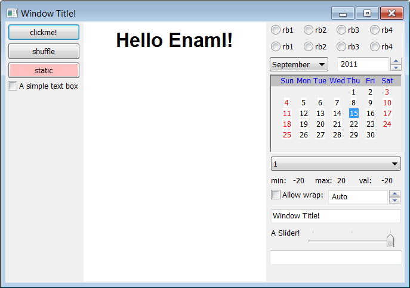

Examples
========

.. todo:: add small example for each widget

Large Example
-------------

Here is an example showcasing most of the wx
based widgets:

.. include:: example.enaml
    :literal:

And the python script to execute it:

.. include:: example.py
    :literal:

Results in the following widget

