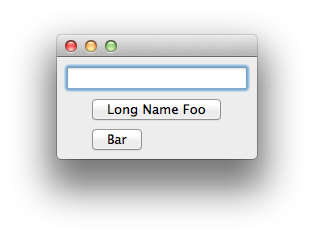

Align Example
===============================================================================

:download:`align.enaml <../../../examples/widgets/align.enaml>`

.. literalinclude:: ../../../examples/widgets/align.enaml
    :language: python

::

 $ enaml-run align.enaml

