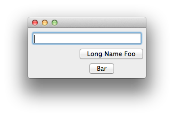

AlignOffset Example
===============================================================================

:download:`align_offset.enaml <../../../examples/widgets/align_offset.enaml>`

.. literalinclude:: ../../../examples/widgets/align_offset.enaml
    :language: python

::

 $ enaml-run align_offset.enaml

