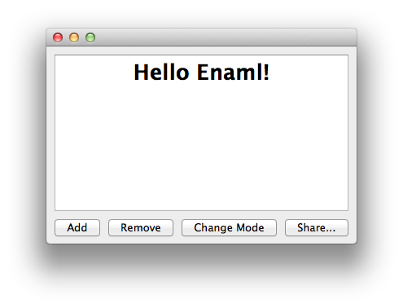
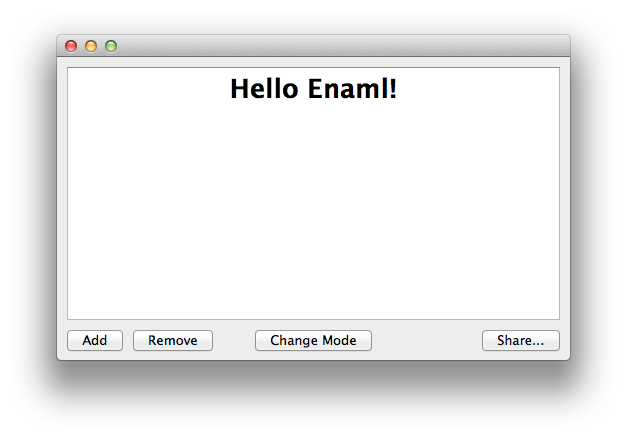

Constrained Layout Example
===============================================================================

:download:`constrained.enaml <../../../examples/constrained/constrained.enaml>`

.. literalinclude:: ../../../examples/constrained/constrained.enaml
    :language: python

::

 $ enaml-run constrained.enaml

.. note:: The "Change Mode" button has a weak constraint to the mid-line.

