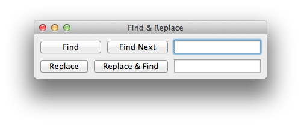

Find Replace Example (Variable-width Buttons Aligned)
===============================================================================

:download:`find_replace.enaml <../../../examples/constrained/find_replace.enaml>`

.. literalinclude:: ../../../examples/constrained/find_replace.enaml
    :language: python

::

 $ enaml-run find_replace.enaml

.. note:: The buttons are nicely aligned, in spite of variable widths.
