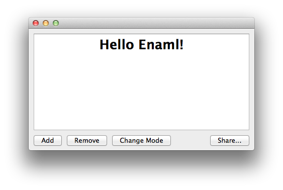

Fluid Example
===============================================================================

:download:`fluid.enaml <../../../examples/widgets/fluid.enaml>`

.. literalinclude:: ../../../examples/widgets/fluid.enaml
    :language: python

::

 $ enaml-run fluid.enaml

