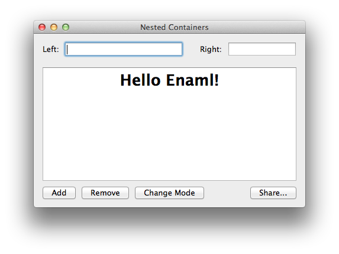

NestedContainers Example
===============================================================================

:download:`nested_containers.enaml <../../../examples/widgets/nested_containers.enaml>`

.. literalinclude:: ../../../examples/widgets/nested_containers.enaml
    :language: python

::

 $ enaml-run nested_containers.enaml

