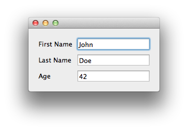

Person Example
===============================================================================

:download:`hello_world.enaml <../../../examples/person/person_view.enaml>`

.. literalinclude:: ../../../examples/person/person_view.enaml
    :language: python

:download:`hello_world.py<../../../examples/person/person.py>`

.. literalinclude:: ../../../examples/person/person.py
    :language: python

::

 $ python person.py

