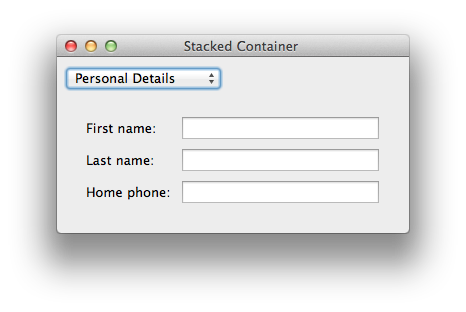
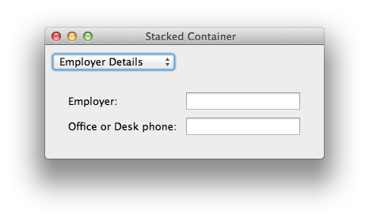

Stacked Forms Example
===============================================================================

:download:`stacked.enaml <../../../examples/stdlib/stacked.enaml>`

.. literalinclude:: ../../../examples/stdlib/stacked.enaml
    :language: python

::

 $ enaml-run stacked.enaml

