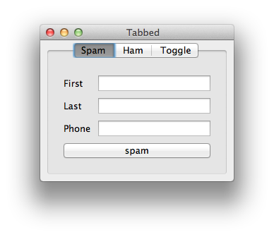
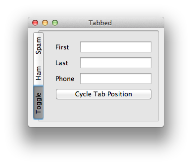

Tabbed Container Example
===============================================================================

:download:`tabbed.enaml <../../../examples/containers/tabbed.enaml>`

.. literalinclude:: ../../../examples/containers/tabbed.enaml
    :language: python

::

 $ enaml-run tabbed.enaml

After two clicks on :guilabel:`Cycle Tab Position`

