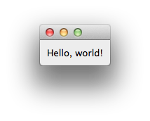
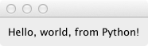

.. _hello-world:

"Hello World" tutorial
===============================================================================

Our goal in this tutorial is to show a minimal example of an |Enaml| user
interface and introduce a few basic concepts. It sets up a minimal GUI to
display a simple message.

Let's get started with a minimalist "hello world" example. |Enaml| interfaces
are described in a file with the ".enaml" extension. While the code has some
similarities to Python, |Enaml| is a separate language.

Here is our minimalist .enaml file describing a message-displaying GUI
(:download:`download here <../../../examples/tutorial/hello_world/hello_world_view.enaml>`):

.. literalinclude:: ../../../examples/tutorial/hello_world/hello_world_view.enaml
    :language: python

Use the ``enaml-run`` utility to run it from the command line with ::

    $ enaml-run hello_world_view.enaml

The resulting GUI looks like this (in Mac OS):

Let's take a closer look at the |Enaml| file.

Enaml Definitions
+++++++++++++++++++++++++++++++++++++++++++++++++++++++++++++++++++++++++++++++

An |Enaml| view is made up of a series of component *definitions* that look a
lot like Python classes. In the first line of code, we are defining a new
component, ``Main``, which derives from ``Window``, a builtin widget in the
|Enaml| standard library.

::

    enamldef Main(Window):

With this line of code, we have defined the start of a *definition block*.
 
In general, we could call this almost anything we want, as long as it is a
Python-valid name. In this case, however, by giving it the special name "Main"
we get to run it from the command line with the ``enaml-run`` tool. 
``enaml-run`` looks for a component named "Main" or a function named "main" 
in an ".enaml" file and runs it as a standalone application.

Definition Structure
+++++++++++++++++++++++++++++++++++++++++++++++++++++++++++++++++++++++++++++++

Inside a definition block, the view is defined in a hierarchical tree of 
widgets. `As in Python
<http://docs.python.org/reference/lexical_analysis.html#indentation>`_ ,
indentation is used to specify code block structure. That is, statements
beginning at a certain indentation level refer to the header line at the next
lower indentation level. So in our simple example, the ``Container`` belongs to
``Main`` and the ``Label`` belongs to the ``Container``::

    enamldef Main(Window):
        attr message = "Hello, world!"
        Container:
            Label:
                text = message

The view is made up of a ``Window`` containing a ``Container`` which in
turn contains a ``Label``, whose ``text`` attribute is set equal to the
``message`` attribute of ``Main``, which has a default value of 
``Hello, world!``. This default value can be changed by the calling function.
(We'll discuss this in more detail in the :ref:`next tutorial <john-doe>`.)

Just like regular Python objects, the widgets used in an Enaml UI must be
defined and/or imported before they can be used. The widgets used in this
tutorial are imported from ``enaml.widgets.api``.

Using the |Enaml| view in Python
+++++++++++++++++++++++++++++++++++++++++++++++++++++++++++++++++++++++++++++++

Now we'll take a look at how to use the view in Python code. First, we import
|Enaml|::

    import enaml

Then we use ``enaml.imports()`` as a `context manager
<http://docs.python.org/release/2.5.2/ref/context-managers.html>`_ for importing
the |Enaml| view.
::

    with enaml.imports():
        from hello_world_view import Main

Enaml is an inherently asynchronous toolkit, with a server running an
application which offers UI sessions that a client may view.  For this simple
example, we'll be working with the client and server both running locally and
in the same process.  Enaml has some utility functions to help with common
situations.

The first thing we do is create the application object which offers the 
``Main`` view as a session::

    app = simple_app(
        'main', 'A customized hello world example', Main,
        message="Hello, world, from Python!"
    )

The first two arguments are a name and brief description of the session offered
by the application.  The third is the view that we want to use to create this
session, in this case ``Main``.  Everything beyond this is optional, but we want
to override the default message for the view with a customized one.

For writing traditional single-process GUI applications, this pattern will
satisfy the majority of use-cases.

Now that we have an application, we need a server object to serve it, and a
client to display it.  In this case we use the Qt local server and client::

    server = QtLocalServer(app)
    client = server.local_client()

Once we have a client, we need to tell it to start the sessions of interest::

    client.start_session('main')

The client has to wait for the server to be available before actually bringing
up a GUI, so the last step is to start the server::

    server.start()

