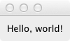

.. _hello-world:

"Hello World" tutorial
===============================================================================

Our goal in this tutorial is to show a minimal example of an |Enaml| user
interface and introduce a few basic concepts. It sets up a minimal GUI to
display a simple message.

Let's get started with a minimalist "hello world" example. |Enaml| interfaces
are described in a file with the ".enaml" extension. While the code has some
similarities to Python, |Enaml| is a separate language.

Here is our minimalist .enaml file describing a message-displaying GUI
(:download:`download here <../../../examples/hello_world/hello_world_minimal.enaml>`):

.. literalinclude:: ../../../examples/hello_world/hello_world_minimal.enaml
    :language: python

Use the special helper function ``enaml-run`` to run it from the command line
with ::

    $ enaml-run hello_world_minimal.enaml

The resulting GUI looks like this (in Mac OS):

.. image:: images/hello_world_minimal.png

Let's take a closer look at the |Enaml| file.

Enaml Declarations
+++++++++++++++++++++++++++++++++++++++++++++++++++++++++++++++++++++++++++++++

An |Enaml| view is made up of a series of component *declarations* that look a
lot like Python classes. In the first line of code, we are declaring a new
component, ``Main``, which derives from ``MainWindow``, a component in the
|Enaml| standard library.

::

 Main(MainWindow):

With the this line of code, we have declared the start of a *declaration
block*.
 
In general, we could call this almost anything we want, as long as it is a
Python-valid name. In this case, however, by giving it the special name "Main"
we get to run it from the command line with the special ``enaml-run``
tool. ``enaml-run`` looks for a component named "Main" and runs it as a
standalone application.

Declaration Structure
+++++++++++++++++++++++++++++++++++++++++++++++++++++++++++++++++++++++++++++++

Inside a declaration block, the view is defined in a hierarchical tree of view
components. `As in Python
<http://docs.python.org/reference/lexical_analysis.html#indentation>`_ ,
indentation is used to specify code block structure. That is, statements
beginning at a certain indentation level refer to the header line at the next
lower indentation level. So in our simple example, the ``Label:`` belongs to
``Main``.

Our view is made up of a ``Window`` containing a ``Label``, whose ``text``
attribute we set equal to ``message``, which is passed in by the calling
function.  (We'll discuss this in more detail in the :ref:`next tutorial
<john-doe>` .)

Using the |Enaml| view in Python
+++++++++++++++++++++++++++++++++++++++++++++++++++++++++++++++++++++++++++++++

Now we'll take a look at how to use the view in Python code. First, we import
|Enaml|:

::

 import enaml

Then we use ``enaml.imports()`` as a `context manager
<http://docs.python.org/release/2.5.2/ref/context-managers.html>`_ for importing
the |Enaml| view.
::

 with enaml.imports():
     from hello_world import MyMessageToTheWorld

Then, we instantiate the view, passing the message to be displayed:
::

 view = MyMessageToTheWorld("Hello, world!")

The ``show()`` method on ``view`` displays the window:
::

 view.show()

