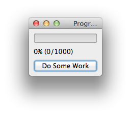

.. _tutorial_more_widgets:

More on |Enaml| Widgets
===============================================================================

In this tutorial, we take a closer look at some of the widgets available for
building GUI's in |Enaml| by building a "working" progress bar. We'll introduce
some new attributes including the ``id`` tag and two new |Enaml| operators: the
subscription operator ``<<`` and the notification operator ``>>`` along with
some component-specific attributes.

Let's start with a code snip from :download:`progress_bar.enaml
<../../../examples/components/progress_bar.enaml>`:

::

 defn ModelView(model):
     Window:
         title = 'Progress Bar'
         ProgressBar:
             id: progress
             value := model.units_done
             maximum := model.work_units
         Label:
             id: label
             text << '{0}% ({1}/{2})'.format(progress.percentage, progress.value, progress.maximum)
         PushButton:
             id: work_button
             text << "Do Some Work" if progress.percentage < 100 else "Reset"
             clicked >> model.do_work() if progress.percentage < 100 else model.reset()

We're setting up a view, and we will pass it a model. The view consists of a
window with three widgets: a ProgressBar, a Label, and a PushButton. (In the
:ref:`tech-ref` you can find a list and descriptions of widgets and components
from the :ref:`built-ins <built-ins-ref>` and :ref:`standard library
<std-library-ref>`.) Starting with the ProgressBar we see something new: an
``id`` tag.

``id`` Tags
-------------------------------------------------------------------------------

|Enaml| uses a special attribute called an ``id`` tag to let you refer to a
component or widget from elsewhere in the declaration. Note that no quotation
marks are necessary. Because of the line ``id: progress`` under
``ProgressBar:`` we can refer to this component as ``progress`` in code blocks
of similar *scope*. (We will have a more detailed discussion of scope later.)
``progress`` has two other attributes whose values we delegate with the ``:=``
operator.

With the Label widget, we introduce a new operator.

Subscription Operator <<
-------------------------------------------------------------------------------

The **subscription operator** ``<<`` is an |Enaml|-specific operator that makes
the object on the left-hand side depend on the value of the Python-valid
expression on the right-hand side of the operator. If there are variables in
the expression on the right-hand side, then |Enaml| registers dependencies for
each, and when any of the variable objects in the expression changes, the
object on the left-hand side will be recomputed.

::

 text << '{0}% ({1}/{2})'.format(progress.percentage, progress.value, progress.maximum)

The ``text`` attribute of the ``Label`` object in our example is *subscribed*
to a formatted string, with dependencies on ``progress.percentage``,
``progress.value``, and ``progress.maximum``.

::

 text << "Do Some Work" if progress.percentage < 100 else "Reset"

The ``work_button`` widget also has a subscribed text attribute; in this case it
is a Python ``if`` statement dependent on the value of
``progress.percentage``.

``work_button`` also has another new operator, the last of the four special
|Enaml| operators.

Notification Operator >>
-------------------------------------------------------------------------------

The **notification operator** ``>>`` is the last |Enaml|-specific operator. It
causes the expression on the right-hand side to be evaluated whenever the
object on the left-hand side fires an event.

::

 clicked >> model.do_work() if progress.percentage < 100 else model.reset() 

In our example, the ``clicked`` attribute of ``work_button`` *notifies*
``model.do_work()`` or ``model_reset()`` depending on the value of the Python
``if`` statement on the right-hand side.

Now let's set up the model using Python code inside Python code tags.

::

 :: python ::

 import random
 from traits.api import HasTraits, Int

 class Model(HasTraits):
     """ Model a process that does some work on command.
     """
     # The total units of work to do.
     work_units = Int(1000)

     # The number of units done.
     units_done = Int(0)

     def do_work(self):
         """ Do a random amount of work.
         """
         nunits = random.randint(10, 100)
         nunits = min(nunits, self.work_units - self.units_done)
         self.units_done += nunits

     def reset(self):
         """ Reset the work done back to 0.
         """
         self.units_done = 0
 :: end ::

Note that logically, this section of Python code should go *before* the veiw
declaration, but |Enaml| files are executed "all at once", and the order of
declaration does not matter [#]_. Within the Python code tags, of course, the normal
rules of Python parsing and execution apply.

With a separate piece of Python code, we set up the main() function for
running from the command line:

::

    :: python ::

    # A 'main' function is special cased as an entry point by the enaml-run script
    def main():
        model = Model()
        window = ModelView(model)
        window.show()

    :: end ::

Execute from the command line with

::

 $ enaml-run progress_bar.enaml 

.. [#] Technically, the right-hand side of an |Enaml| operator acts as a
   closure which has access to all of the identifiers declared in the block.
