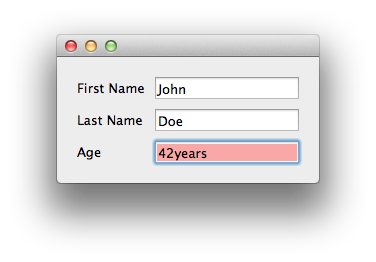
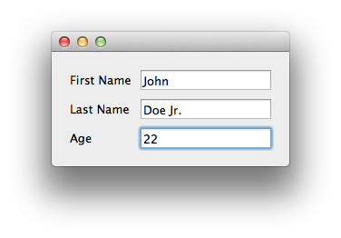

.. _john-doe:

John Doe tutorial
===============================================================================

This tutorial expands on the :ref:`"Hello World" Tutorial <hello-world>` to
introduce the concepts of reusable component declarations and components from
the standard library in |Enaml|. It sets up a GUI with the name and age of a
person.

Here is the |Enaml| file (:download:`download here
<../../../examples/person/person_view.enaml>`):

.. literalinclude:: ../../../examples/person/person_view.enaml
    :language: python

Here is the Python code (:download:`download here
<../../../examples/person/person.py>`):

.. literalinclude:: ../../../examples/person/person.py
    :language: python

The resulting GUI looks like this (in Mac OS):

.. image:: images/john_doe.png

|Enaml| Imports
+++++++++++++++++++++++++++++++++++++++++++++++++++++++++++++++++++++++++++++++

This .enaml file begins like the :ref:`"Hello World" <hello-world>` example
with comments, but next we see that we can do imports in Enaml, like in Python.
::

 from enaml.stdlib.fields import IntField

In this case, we are importing the integer field widget ``IntField`` from
|Enaml|'s :ref:`standard component library.<std-library-ref>` This component
lets us assign an integer value in a text field, with validation and error
checking. Note that this import points to a component declaration in a
``.enaml`` file. *The import statement looks like Python but imports from an
.enaml file.*

Component Declaration Block
+++++++++++++++++++++++++++++++++++++++++++++++++++++++++++++++++++++++++++++++

Next, there is a new kind of code block, a **component declaration**. We define
a component, in this case an entry form, using a component hierarchy
declaration. With this block of code, we define a reusable component derived
from other components.

::

 PersonForm(Form):
     person = None
     Label:
         text = 'First Name'
     Field:
         value := person.first_name
     Label:
         text = 'Last Name'
     Field:
         value := person.last_name
     Label:
         text = 'Age'
     IntField:
         value := person.age 

A component declaration block header line begins with the name of the component
followed by the base component or widget it inherits from, if any. The header
line ends with a colon.
::

 PersonForm(Form):

Indented under the header line are statements declaring either attributes or
children. ``person = None`` initializes a ``person`` attribute of
``PersonForm``. 

Built-in Components
+++++++++++++++++++++++++++++++++++++++++++++++++++++++++++++++++++++++++++++++

Next, we add a series of labels and fields. ``Form``, ``Label`` and ``Field``
are all from the library of |Enaml| :ref:`built-in components. <built-ins-ref>`

:py:class:`~enaml.widgets.form.Form` is a built-in container that arranges
alternating child components into two columns. This is typically done in the
way seen here with alternating ``Label:`` and widget children. In a form with
an odd number of components, the last component spans both columns.

:py:class:`~enaml.widgets.label.Label` is a built-in component for displaying
read-only text.

:py:class:`~enaml.widgets.field.Field` is a built-in widget for entering a text
value. Field is used as the base component for many other components that do
type conversions.

Delegation Operator :=
+++++++++++++++++++++++++++++++++++++++++++++++++++++++++++++++++++++++++++++++

In the ``Field`` code block, we notice a new operator ``:=``. This is the
:ref:`delegation operator<delegation-opr>`, one of the four special operators in
the |Enaml| :ref:`grammar<grammar-ref>`. It sets up a two-way synchronization
between the objects on the left-hand and right-hand sides. That is, changes to
the value of the text field in the GUI widget are applied to the value of
person.first_name, and changes to the value of person.first_name are displayed
in the GUI component.

Standard Library of Derived Components
+++++++++++++++++++++++++++++++++++++++++++++++++++++++++++++++++++++++++++++++

The ``IntField`` component is derived from ``Field`` and provides a
string-to-integer conversion, validation, and error reporting functions.By
using the ``IntField`` component, we add validation to the GUI, as shown in the
example below, where a non-integer value was entered in the age field:

``defn`` Block
+++++++++++++++++++++++++++++++++++++++++++++++++++++++++++++++++++++++++++++++

Now, with a ``defn`` block, we can make a view available using our previously
declared ``PersonForm``. If we wanted to, we could add ``PersonForm`` many
times over in this view, but for now we'll keep it simple. Note that we will
pass a ``person`` object to the view.

::

 defn PersonView(person):
     Window:
         PersonForm:
             person = person

Now, on to the Python code.

Traits Object
-------------------------------------------------------------------------------

|Enaml| is designed to work with `Traits objects
<http://code.enthought.com/projects/traits/>`_. The important thing to note is
that the ``Person`` attribute names match the names of the ``PersonForm``
attributes from the .enaml file. 
::

 class Person(HasTraits):
    """ A simple class representing a person object.

    """
    last_name = Str

    first_name = Str

    age = Range(low=0)

    @on_trait_change('age')
    def debug_print(self):
        """ Prints out a debug message whenever the person's age changes.

        """
        templ = "{first} {last} is {age} years old."
        print templ.format(first=self.first_name, 
                           last=self.last_name, 
                           age=self.age)

Note that our ``Person`` class is designed to print out the name and age of the
person when the ``age`` attribute changes. See the `Traits user guide
<http://github.enthought.com/traits/traits_user_manual/index.html>`_ for help
on Traits.

Hooking up an |Enaml| View to a Traits Object
+++++++++++++++++++++++++++++++++++++++++++++++++++++++++++++++++++++++++++++++

In the code block for launching the script from the command line, we create a
Person object and pass it to ``PersonView``.

::

 if __name__ == '__main__':
     import enaml
     with enaml.imports():
         from person_view import PersonView
    
     john = Person(first_name='John', last_name='Doe', age=42)
    
     view = PersonView(john)
     view.show()

Running it from the command line, we see
::

 $ python person.py
  is 42 years old.

.. image:: images/john_doe.png

Note that the age was assigned before the first and last names, so that those
fields are empty when Person() prints to the command line. That's not the case
when we make a change in the GUI and see
::

 John Doe Jr. is 22 years old.

