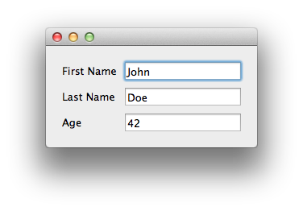

.. _hello-john-doe:

Hello John Doe tutorial
===============================================================================

This is a basic tutorial to explain the basic features of an |Enaml| user
interface. It uses sets up a GUI with the name and age of a person.

Source
-------------------------------------------------------------------------------

:download:`.enaml file <../../../examples/person/person_view.enaml>`

:download:`Python file <../../../examples/person/person.py>`

Let's get started with a basic hello-world type example. We will create a GUI
to view or change the information about a person.

An |Enaml| GUI comprises two components: the .enaml file (describing the view)
and the Python code to execute it. The .enaml file describing a person for our
example is shown here (and can be downloaded from the link above):

.. literalinclude:: ../../../examples/person/person_view.enaml
    :language: python

The Python code to use the GUI is shown here (and can be downloaded from the
other link above):

.. literalinclude:: ../../../examples/person/person.py
    :language: python

The resulting GUI looks like this (in Mac OS):

Walk-through
-------------------------------------------------------------------------------

Let's take a closer look at the files.

|Enaml| file
_______________________________________________________________________________

Imports
+++++++++++++++++++++++++++++++++++++++++++++++++++++++++++++++++++++++++++++++

Imports similar to Python.

::

 from enaml.stdlib.fields import IntField

In this case, we are importing the integer field widget IntField from the
:ref:`standard component library.<std-library-ref>` This is the component that
lets us assign an integer value in a text field, with validation and error
checking. Note that this import points to a component declaration in a
``.enaml`` file. *The import statement looks like Python but imports from an
.enaml file.*

Component Declaration Block
+++++++++++++++++++++++++++++++++++++++++++++++++++++++++++++++++++++++++++++++

Next, we define an entry form using a *class-like* component hierarchy
declaration. With this block of code, we define a reusable component derived
from other components.

::

 PersonForm(Form):
     person = None
     Label:
         text = 'First Name'
     Field:
         value := person.first_name
     Label:
         text = 'Last Name'
     Field:
         value := person.last_name
     Label:
         text = 'Age'
     IntField:
         value := person.age 

The syntax of Python is copied in several aspects of the declaration.
 - ``PersonForm(Form)`` indicates that the new component ``PersonForm`` inherits from
   the |Enaml| :ref:`built-in component <built-ins-ref>` `Form`.
 - A colon ``:`` marks the end of a declaration header.
 - Indentation is used to specify code block structure.

With ``person = None`` we are initializing the ``person`` attribute of
``PersonForm``.

Next, we add a series of labels and fields. ``Label`` and ``Field`` are both from
the library of |Enaml| :ref:`built-in components. <built-ins-ref>` Assignments
are made to a component in an indented block. The assignments are made as if
they were within an implicit ``with(Label):`` block.

In the ``Field`` code block, we notice a new operator ``:=``. This is the
:ref:`delegation operator<delegation-opr>`, one of the four special operators in
the |Enaml| :ref:`grammar<grammar-ref>`. It sets up a two-way synchronization
between the objects on the left-hand and right-hand sides. That is, changes to
the value of the text field in the GUI widget are applied to the value of
person.first_name, and changes to the value of person.first_name are displayed
in the GUI component.

The ``IntField`` component provides a string-to-integer conversion, validation,
and error reporting function. It is derived from the ``Field`` component used
elsewhere in the widget. By using the ``IntField`` component, we add validation
to the GUI, as shown in the example below, where a non-integer value was
entered in the age field:

``defn`` Block
-------------------------------------------------------------------------------

With a ``defn`` block, we create a particular instance of the reusable
component declared in the previous code block. This then becomes availble for
external Python functions to import. With a ``defn`` block header, we specify
the *arguments* that will be passed in by the calling Python function.

.. note:: The header line of a *component declaration block* specifies
   **inheritance**, while the header line of a *defn block* specifies the
   **signature** for the calling function.

::

 defn PersonView(person):
     Window:
         PersonForm:
             person = person

As with the component declaration block, the ``defn`` block specifies a
hierarchy tree of components. Here, the ``PersonView`` is made up of a
``Window`` (a :ref:`built-in component <built-ins-ref>) containing a
``PersonForm`` (defined above). ``The PersonForm`` 's ``person`` attribute (on
the left-hand side) is set equal to the ``person`` argument passed in by the
calling Python function.

Python code
_______________________________________________________________________________

Traits Object
-------------------------------------------------------------------------------
|Enaml| is designed to work with `Traits
<http://code.enthought.com/projects/traits/>`_. The important thing to note is
that the ``Person`` attribute names exactly match the names of the
``PersonForm`` attributes from the .enaml file. Our ``Person`` class is
designed to print out a debug statement when the ``age`` attribute changes.
*(Run the example to confirm this.)* So far the Person class is just like any
other Traits class. `See the Traits user guide for
help. <http://github.enthought.com/traits/traits_user_manual/index.html>`_

Hooking up the |Enaml| view
-------------------------------------------------------------------------------
The |Enaml| particulars show up in the code block for launching the script from
the command line:

::

 if __name__ == '__main__':
     import enaml
     with enaml.imports():
         from person_view import PersonView
    
     john = Person(first_name='John', last_name='Doe', age=42)
    
     view = PersonView(john)
     view.show()

First, we ``import enaml``.

Then we use ``enaml.imports()`` as a `context manager
<http://docs.python.org/release/2.5.2/ref/context-managers.html>`_ for importing
the |Enaml| view.
::

 with enaml.imports():
     from person_view import PersonView

