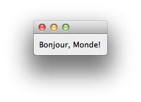
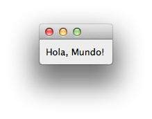

.. _tut_python_code:

enaml-run and Python code tags in |Enaml| files
===============================================================================

In this tutorial, we introduce the ``enaml-run`` command-line tool for
quickstart and debugging purposes, and we show how to insert Python code blocks
into an |Enaml| file. This is useful for setting up variables and substitutions
in the GUI definition and as a convenience for self-contained GUI
applications. (It is in fact a great convenience for tutorials, examples, and
demonstrations.)

enaml-run
-------------------------------------------------------------------------------
|Enaml| comes with a convenience utility that runs from the command-line:

::

 enaml-run <enaml_filename.enaml>

``enaml-run`` looks for a component called "MainWindow" or a Python main()
function in *enaml_filename.enaml* and runs it as a stand-alone program.

The MainWindow component
-------------------------------------------------------------------------------
MainWindow is defined in a component declaration block or in a ``defn`` block,
so it can be called and executed from within Python code as usual. This is just
a convenience that allows you to try out your user interface without running
all of the other code that may go with it in the end application. (In fact, you
can pass the name of any component in an enaml file to ``enaml-run``;
``MainWindow`` is just the default.)

Let's rewrite our "hello world" example to take advantage of the convenience
function:

.. literalinclude:: ../../../examples/hello_world/hello_world_main_window.enaml
    :language: python

:download:`download <../../../examples/hello_world/hello_world_main_window.enaml>`
and run it from the command line:

::

 $ enaml-run hello_world_main_window

If your component takes an argument, you can insert your calling Python code
into the |Enaml| file.

Python code tags in an |Enaml| file
-------------------------------------------------------------------------------
You can insert Python code to be executed when the component is imported using
the following tags:

::

 :: python ::

 # python code goes here

 :: end ::

This enables more complexity in your test or demo, as in this version of our
"hello world" example. Note that we have effectively rolled all of the calling
code that used to be in "hello_world.py" into the enaml file. Remember that
``enaml-run`` looks for a Python function called "main()".

.. literalinclude:: ../../../examples/hello_world/hello_world_main_window_args.enaml
    :language: python

:download:`download <../../../examples/hello_world/hello_world_main_window_args.enaml>`
and run it from the command line:

::

 $ enaml-run hello_world_main_window_args

